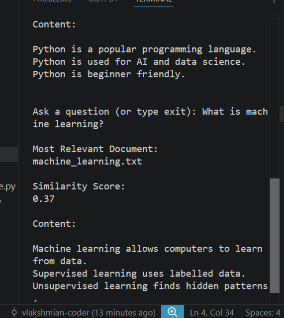
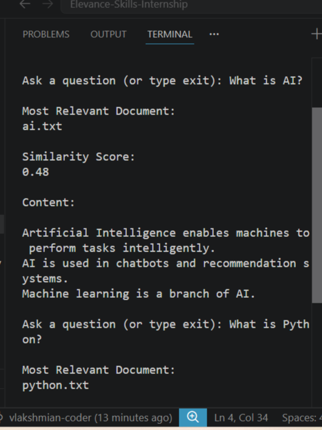

# Dynamic Knowledge Base Chatbot

## Project Overview

This project implements a chatbot knowledge base using Natural Language Processing (NLP).

The chatbot automatically reads text documents from a knowledge base, converts them into TF-IDF vectors, and retrieves the most relevant document based on the user's question.

It also supports automatic knowledge base expansion by adding new documents without changing the source code.

---

## Features

- Text preprocessing
- Bag of Words
- TF-IDF Vectorization
- Automatic document loading
- Document similarity search
- Automatic knowledge base updates
- Interactive chatbot interface

---

## Technologies Used

- Python
- Scikit-learn
- TF-IDF
- Cosine Similarity
- NLP

---

## Project Structure

```
Project-1/
│
├── knowledge_base/
├── new_documents/
├── src/
│   ├── preprocess.py
│   ├── bag_of_words.py
│   ├── tfidf.py
│   ├── read_documents.py
│   ├── vectorize_documents.py
│   ├── search_documents.py
│   └── update_knowledge_base.py
│
├── README.md
└── requirements.txt
```

---

## How to Run

1. Install the required libraries.

```
pip install -r requirements.txt
```

2. Run the chatbot.

```
python src/search_documents.py
```

3. Ask questions.

Example:

```
What is AI?
What is Python?
What is Machine Learning?
```

Type

```
exit
```

to quit.

---

## Future Improvements

- Sentence Transformers
- FAISS Vector Database
- LangChain Integration
- Llama / Ollama Integration
- Web Interface using Streamlit

## Chatbot Demo

### Example 1 - AI Question



The chatbot correctly identifies **ai.txt** as the most relevant document and returns the answer with a similarity score.

---

### Example 2 - Machine Learning Question



The chatbot correctly retrieves information from **machine_learning.txt** and displays the relevant content.
---

## Author

Vijayalakshmi Narayanan


